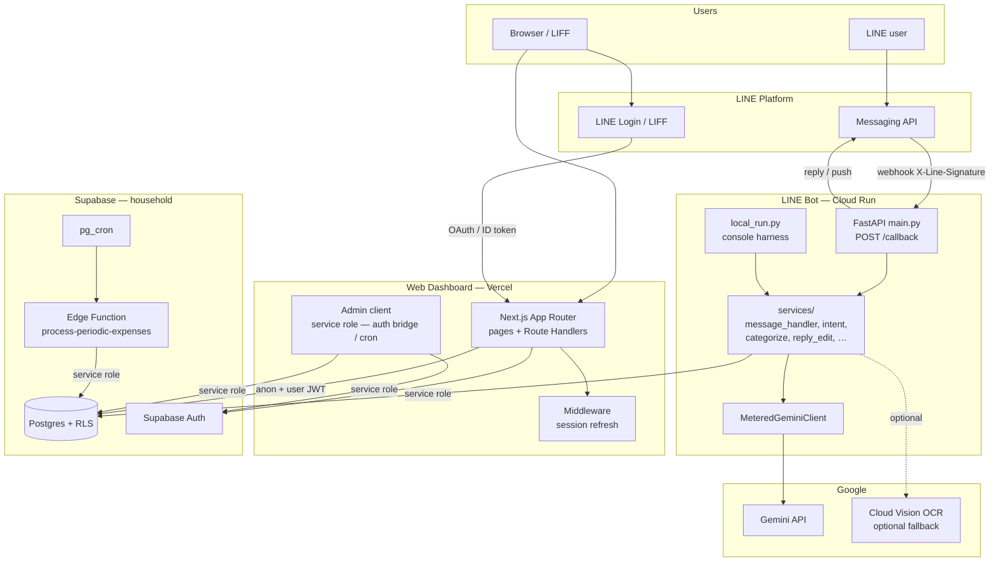
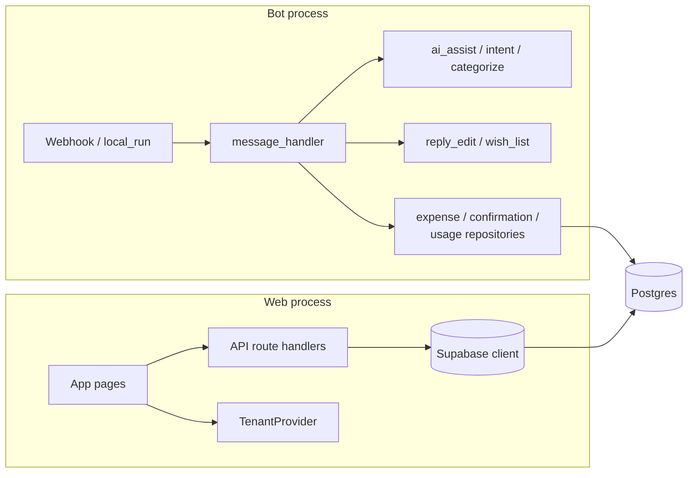
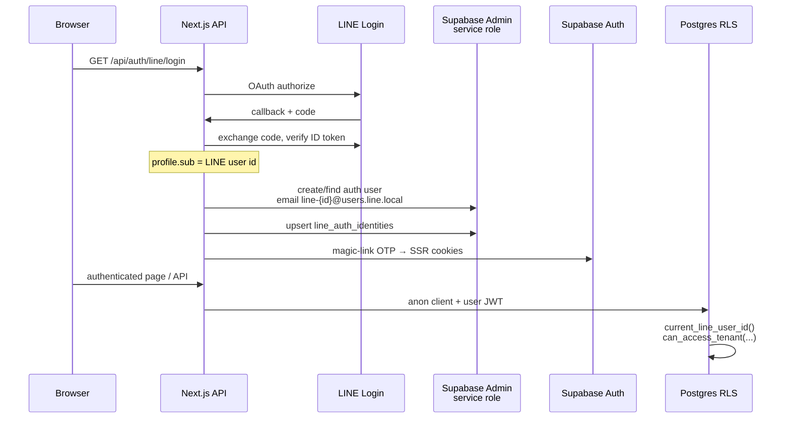
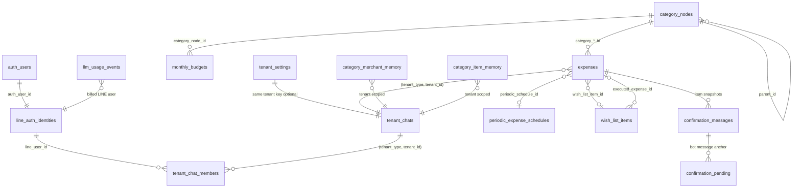
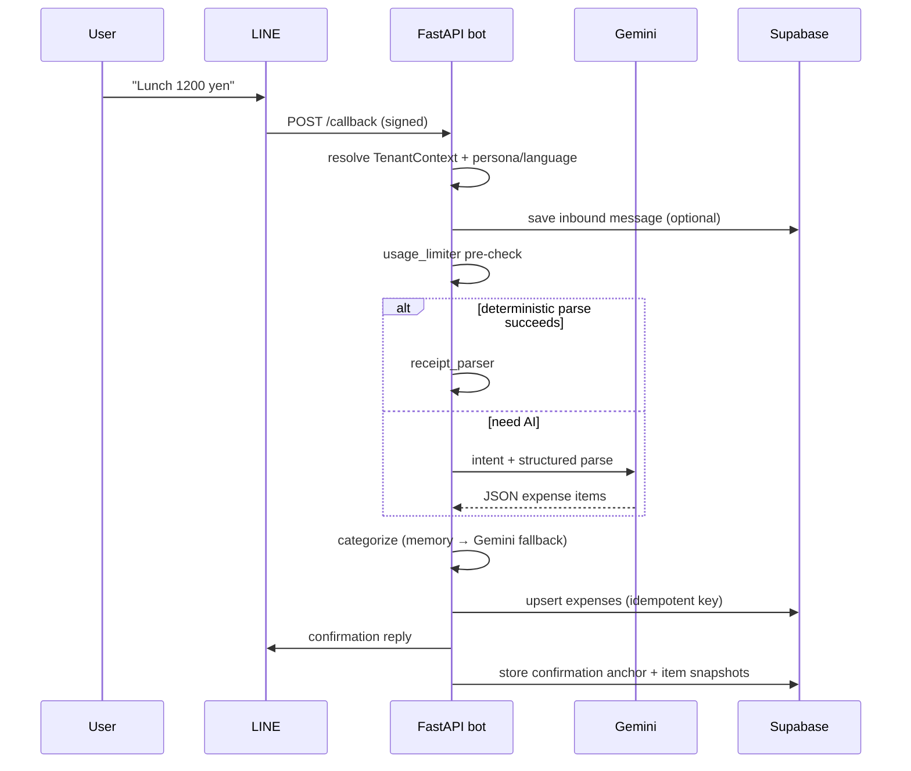
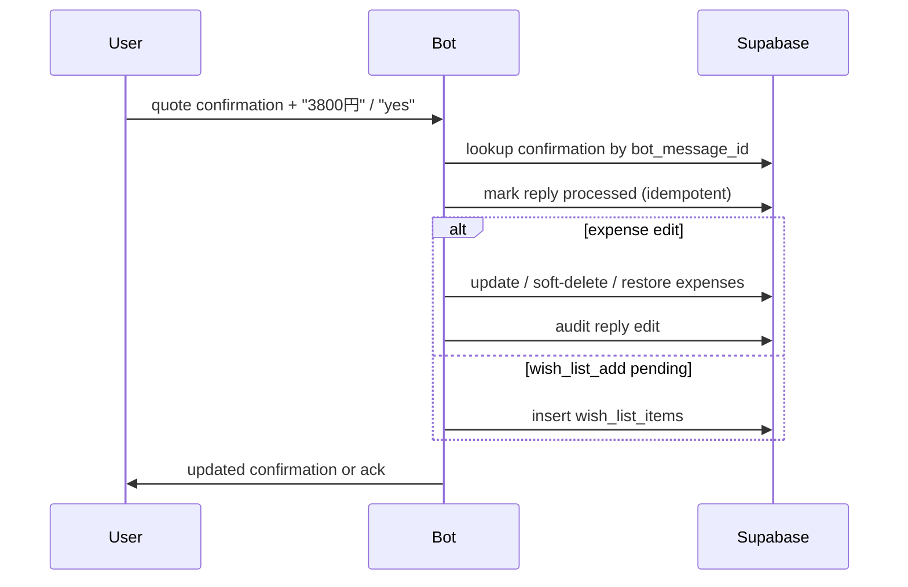
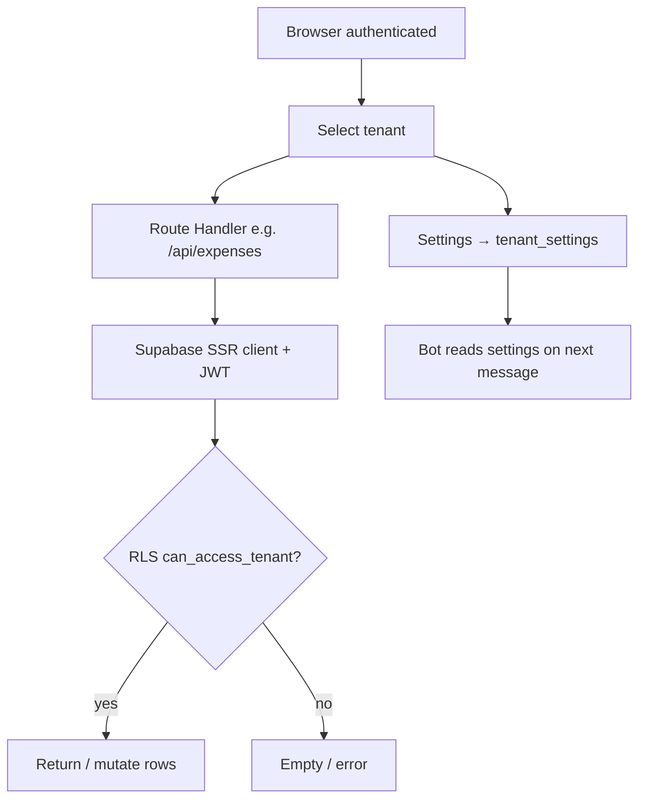

# System Architecture

Guide for new engineers: what this system is, how the LINE bot and web dashboard fit together, and the design choices that keep them coherent.

**Related docs:** [root README](../README.md) (quick start) · [local setup](../specs/003-local-dev-setup/quickstart.md) · [web dashboard](../specs/009-expense-web-dashboard/quickstart.md) · [AGENTS.md](../AGENTS.md) (Cloud/agent gotchas) · [constitution](../.specify/memory/constitution.md)

**Maintenance:** Agents and humans must update this document in the same PR when a change impacts architecture (deployables, auth/RLS, schema/tenant model, primary flows, or design decisions). See [`.cursor/rules/architecture-docs.mdc`](../.cursor/rules/architecture-docs.mdc) and AGENTS.md “Architecture doc sync.”

---

## 1. System overview

**linebot-money-tracker** is a household expense tracker with two user surfaces and one shared backend:

| Surface | Stack | Role |
| ------- | ----- | ---- |
| **LINE bot** | Python 3.11+, FastAPI, LINE Messaging API, Gemini | Fast capture: text, receipt photos, reply-edits, wish-list proposals |
| **Web dashboard** | Next.js 15 (App Router), React 19, Vercel | Browse/edit expenses, budgets, categories, settings, wish list, periodic expenses |
| **Shared backend** | Supabase (Postgres + Auth + RLS + Edge Functions) | Source of truth for ledgers, auth identity bridge, cron |

Users log spending in LINE (or the console harness). Confirmations become **reply anchors** so quoted replies can edit, categorize, delete, or confirm wish-list adds. The web app is the management surface for the same tenant-scoped data.

### High-level features

- **Expense capture** — free-form text and receipt images → structured line items with amount, date, merchant, category
- **Reply edits** — quote the bot confirmation to change amount/category/date, soft-delete, restore, or bulk-recategorize
- **Wish list** — “want to buy” proposals with budget-impact preview; confirm in chat or manage/execute in the web app
- **Multi-tenant ledgers** — personal (`user`) and shared (`group` / `room`) ledgers with membership
- **Categories & memory** — two-level tenant taxonomy (lazy-copied from templates); merchant/item memory improves future categorization
- **Budgets & pace** — monthly total / L1 / L2 budgets; bot can warn when spend or a wish exceeds daily pace
- **Periodic expenses** — scheduled recurring charges materialized into `expenses` via cron/Edge Function
- **Bot behavior settings** — reply language, persona, emoji level, confirmation detail (set in web, honored in bot)
- **LLM metering** — free-tier quotas, rate limits, and group quota pooling
- **Dashboard auth** — LINE Login / LIFF → Supabase Auth session → RLS-scoped data access

---

## 2. How to read the architecture

For onboarding, prefer this order:

1. **Container diagram** (this section) — who talks to whom
2. **Auth model** (§3) — why bot and web use different credentials
3. **Data model** (§4) — tenant key and core tables
4. **Sequence diagrams** (§5) — expense log, reply-edit, web login
5. **Design decisions** (§6) — why it is shaped this way

Mermaid renders in GitHub and most Markdown previews. Spec Kit feature folders under `specs/` hold deeper plans per feature.

### 2.1 Container diagram (system at a glance)



### 2.2 Logical components (bot vs web)



---

## 3. Authentication and authorization

Two different trust models share the same Postgres data.

### 3.1 LINE bot (Messaging API)

| Concern | Mechanism |
| ------- | --------- |
| **Inbound authenticity** | `X-Line-Signature` verified with `LINE_CHANNEL_SECRET` via LINE `WebhookParser` |
| **Outbound** | `LINE_CHANNEL_ACCESS_TOKEN` for replies and content fetch |
| **Database** | **Service role** only (`SUPABASE_SERVICE_ROLE_KEY`) — bypasses RLS |
| **User identity** | LINE `userId` / `groupId` / `roomId` from the event source → `TenantContext` |

The bot never uses the anon key. It is a trusted backend: it must enforce its own tenant scoping in application code when writing rows.

### 3.2 Web dashboard (LINE Login → Supabase Auth)



Important constraints:

- **LINE Login and Messaging API must be under the same LINE provider** so `profile.sub` matches webhook `userId`s.
- Browser data access uses the **anon key + user session**; RLS is the authorization boundary.
- **Service role** on the web side is limited to server routes that need it: auth bridge, periodic cron helper — never shipped to the client.

### 3.3 RLS access model

Central helper: `can_access_tenant(tenant_type, tenant_id)`

- Personal: `tenant_type = 'user'` and `tenant_id = current_line_user_id()`
- Shared: membership row in `tenant_chat_members` for that group/room

| Data | Web (authenticated) | Bot (service role) |
| ---- | ------------------- | ------------------ |
| `expenses`, categories, budgets, settings, wish list, periodic schedules | RLS via `can_access_tenant` | Full access; app scopes writes |
| `line_auth_identities` | Select own row | N/A / admin bridge |
| Confirmation anchors, inbound messages, reply audits, LLM usage, category memory | **Denied** (backend-only lock-down) | Service role CRUD |

Soft-delete is the delete model for expenses (`deleted_at`); web “delete” is an update under RLS.

### 3.4 Tenant switching (web)

After login, the dashboard loads the personal tenant plus group/room tenants from membership. The selected tenant is stored in `localStorage` (`TenantProvider`). All list/mutation APIs are tenant-scoped.

---

## 4. Data structure

### 4.1 Tenant key

Canonical ledger identity:

```text
(tenant_type, tenant_id)
  user  + <LINE user id>
  group + <LINE group id>
  room  + <LINE room id>
```

Attribution (who sent the message) is separate: `logged_by_line_user_id` / expense `line_user_id` fields. Shared ledgers still record the individual sender.

### 4.2 Entity relationship (core)



### 4.3 Table groups

**Identity & tenancy**

- `line_auth_identities` — maps Supabase `auth.users` ↔ LINE user id
- `tenant_chats` / `tenant_chat_members` — shared ledger metadata and membership (also used for usage pooling)

**Ledger**

- `expenses` — line items; unique on `(tenant_type, tenant_id, source_message_id, line_item_index)`; soft-delete; optional links to periodic schedules and wish-list items
- `v_expenses_enriched` — view joining category names (`security_invoker` so RLS still applies)
- `category_nodes` — taxonomy; template rows (`tenant_*` null) lazy-copied per tenant
- `monthly_budgets` — `budget_level` in `total` | `l1` | `l2`
- `tenant_settings` — fiscal month start, bot persona, reply language, confirmation detail

**Wish list & schedules**

- `wish_list_items` — `active` | `executed`; web execute creates an expense
- `periodic_expense_schedules` — recurrence + `next_run_date`; cron materializes expenses

**Bot-only (no web RLS access)**

- Confirmation / inbound / processed-reply tables — reply-edit and retry anchors
- `llm_usage_events`, `user_usage_summary`, `llm_message_windows` — metering
- `category_merchant_memory`, `category_item_memory` — categorization learning

Schema history lives in `supabase/migrations/`. Prefer reading recent migrations and the feature plans under `specs/` over assuming the original 004 schema is complete.

---

## 5. Key data flows

### 5.1 Text expense logging (LINE)



Image path is the same after image fetch + preprocess + Gemini vision (+ optional validation retry). Wish-list phrases branch before expense persistence and create a **pending confirmation** instead of expenses.

### 5.2 Reply edit / wish confirm



### 5.3 Web expense / settings path



### 5.4 Periodic expenses

`pg_cron` → Supabase Edge Function `process-periodic-expenses` (service role) → due `periodic_expense_schedules` → insert `expenses` → advance `next_run_date`. The web app can also expose a protected cron route for operational flexibility.

### 5.5 Console harness (no LINE)

`local_run.py` builds a synthetic LINE user/message id, optionally `--group-id` / `--room-id`, and calls the same `services/` handlers. Persistence and metering require Supabase env vars; Gemini is always required for the running harness.

---

## 6. Key design decisions

| Decision | Rationale |
| -------- | --------- |
| **Two deployables, one database** | Chat latency and LINE SDK fit Python/FastAPI; dashboard UX fits Next.js/Vercel. Shared Postgres keeps one ledger. |
| **Service role in bot; RLS in web** | Bot is a single trusted worker with LINE-proven identity. Browser must not hold privileged keys; RLS encodes membership. |
| **LLM emits JSON only; app persists** | Gemini never talks SQL. Validation, taxonomy mapping, and idempotent upserts stay in application code. |
| **`(tenant_type, tenant_id)` everywhere** | Group/room shared ledgers without overloading personal `line_user_id` as the ledger key. |
| **Confirmation message anchors** | LINE has no built-in “edit this expense” UI; quoting the bot message is the interaction model. |
| **Idempotent expense keys** | Retries and duplicate webhooks must not double-count: unique on tenant + source message + line index. |
| **Lazy-copy category taxonomy** | Tenants start from shared templates; first edit copies nodes and remaps expenses by category code. |
| **Budgets aggregated on read** | Avoid denormalized counters that drift; `get_budget_summary` (and bot pace logic) compute from expenses. |
| **Wish list ≠ expense until execute/confirm** | Intent to buy is a separate lifecycle; budget impact is hypothetical until purchase. |
| **Persona/i18n via settings + contextvars** | Web configures behavior; bot resolves effective settings (shared ledger → personal fallback → defaults) and scopes persona for the request. |
| **Metered Gemini wrapper** | Quotas and pooling live next to the LLM client so every call path is covered. |
| **Backend-only tables locked from JWT roles** | Confirmation/usage/memory tables are bot infrastructure, not dashboard features. |
| **Spec Kit + constitution** | Features are specified/planned/tasked under `specs/`; test-suite expansion is required for user-facing work. |
| **Functional tests mock externals** | CI runs pytest / vitest / Playwright without mutating the live household ledger. |

---

## 7. Other important aspects

### 7.1 Repository layout

```text
/
  main.py              # FastAPI LINE webhook
  local_run.py         # Console harness (same services/)
  services/            # Bot business logic
  tests/               # Unit + tests/functional/bot
  supabase/migrations/ # Schema source of truth
  supabase/functions/  # Edge Functions (periodic expenses)
  web/                 # Next.js dashboard (Vercel root)
  specs/               # Spec Kit feature specs, plans, quickstarts
  docs/ARCHITECTURE.md # This document
```

### 7.2 Deployment & environments

| Component | Host | Notes |
| --------- | ---- | ----- |
| Bot | Cloud Run (Docker; Tesseract + jpn in image) | Unauthenticated HTTPS endpoint; auth is LINE signature |
| Web | Vercel (`web/` as project root) | Needs public Supabase URL/anon key + server secrets |
| DB | Supabase project `household` | Migrations applied via Supabase; do not ad-hoc-edit production without migrations |

Env contracts: root `.env.example`, `web/.env.example`, and `specs/003-local-dev-setup/contracts/environment-variables.md`.

### 7.3 LLM and reliability boundaries

- Model fallback chain and retries live in `gemini_client.py`; metering in `metered_gemini.py`.
- Pre-LLM guards: payload size, per-minute/day rates, monthly total and receipt quotas, group donor pooling.
- Receipt validation can reject sum-mismatched OCR/vision output and retry once.
- Fail-open when Supabase is unset: parsing and replies still work; persistence/metering skip — used by key-free unit tests.

### 7.4 Observability

- Structured logging in the bot; optional Sentry (`SENTRY_DSN`) for ERROR+ issues.
- Usage events/summaries support product metering and debugging quota denials.

### 7.5 Internationalization & persona

All user-facing bot copy should go through `confirmation_i18n.t()` inside `persona_scope(...)`. Do not use raw message-language detection alone for outbound language — resolve via `resolve_tenant_reply_language` / effective bot settings (see AGENTS.md).

### 7.6 Testing expectations

| Suite | Command | Purpose |
| ----- | ------- | ------- |
| Bot unit + functional | `python3 -m pytest -q` | Pipeline, reply-edit, wish list (mocked) |
| Web unit/functional | `cd web && npm test` | API/UI logic |
| Web e2e | `cd web && npx playwright test` | Auth gate + signed-in smoke |

New user-facing features must extend these suites. Never point automated tests at the live household ledger for mutations.

### 7.7 Spec-driven delivery

Active feature context is in `.specify/feature.json` (not necessarily the git branch name). Plans and quickstarts under `specs/NNN-*` are the detailed design record; this document is the cross-cutting map.

---

## 8. Suggested onboarding path

1. Skim this document (containers + auth + tenant key).
2. Run `python3 -m pytest -q` and `cd web && npm test` to see what is covered.
3. Trace one console expense: `python3 local_run.py --text "Lunch 1200 yen"` (needs `GEMINI_API_KEY`).
4. Read `services/message_handler.py` and `services/tenant_context.py`.
5. Read `web/src/lib/line/session.ts` and `web/src/components/TenantProvider.tsx`.
6. Open recent migrations for expenses, RLS, wish list, and backend-only lockdown.
7. Pick one feature folder in `specs/` related to your task and read its `plan.md` + `quickstart.md`.
